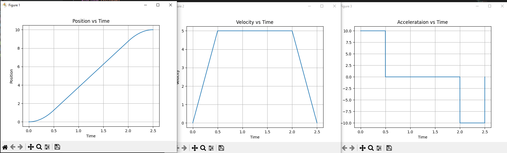
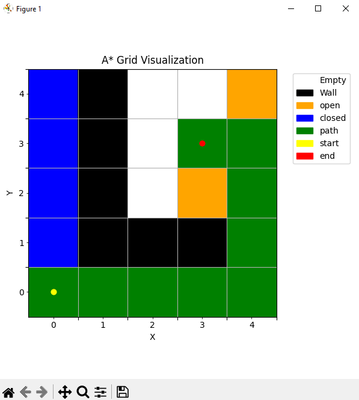
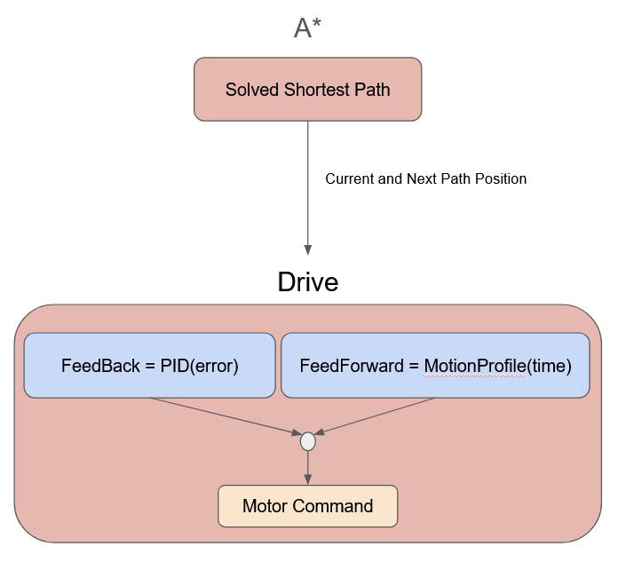

### Fully autonomous (full_auto) robot capable of path planning and motion profiling. 

# Demo
Demo of fully autonomous robot navigating path found from A*. Robot controlled using motion profiling and PID. 

# Motion Profiling
Motion profiling allows for predicable and fluid motion. This robot utilizes a trapezoidal motion profile which
has three phases accerlation, cruise, and deceleration. The name comes from the trapezoidal appearance of the 
velocity curve. 

The velocity and accerlation and capped. The max values where determined through expirimental testing of the robot hardware. 

    

Below is an example of how the curve looks like when reaching the max velocity is not possible. 
Intead of producing a trapezoidal curve it becomes a triangle since the cruise phase was not reached. 
This often happens during very small movements where getting to all three phases is not possible. 

    

# A* Path Planning Algorithm
A* is a path planning algorithm for efficiently finding the shortest path in a graph. This implementation uses a grid based graph. 
The algorithm tracks the cost of each node using hte distance from start (g_cost) and the distance to the target (h_cost). It also
tracks the nodes in a open to exploring list (open list) and not worth exploring any more list (closed list), everything else is in
the new list. 

In summary, as the algorithm explores the current node, it moves from open to closed then surronding nodes that are not walls are 
made into open nodes. Each newly assigned open node gets their g_cost and h_cost calculated. Next, the total cost of each node is compared
then the node with the lowest cost becomes the new current. This continues until the current node becomes the target node. 

    

# Design

    

Given a start, end, and wall positions the A* algorithm will produce the best path to reach the target. This path 
is then sent to the drive in pieces so that it may peform the needed actions to reach the positions. 

The motion profile will produce the desired position, velocity, and acceleration at each time interval given 
the start and end position, max velocity, and max acceleration. The motion profile output can act as a feedforward
control command. It was do the heavy lifting while PID will correct for any difference between the desired and actual
values and will act as a feedback command. 

The sum of feedforward and feedback will produce a command that is given to the motors managed by the the drive. The drive
also manages encoder and imu sensors for ensuring proper navigation. 

# Testing
A testing pipeline was created to test the A* and motion profiling without the need
for physical hardware. First a C++ program that simulates the usage of the system is used
to produce and save the output into CSV files. Since the A* and motion profiling software 
where created without any hardware dependecies such as Arduino.h, the simulated usage script
follow as well. This means that the testing can truely be done without any hardware. Furthermore,
integrating the A* and motion profiling would be a lot simplier with this approach.
After the CSV output files are produced, a python script is use to visualize the data to 
facilitate verification. These visualizations are also used for documentation. 